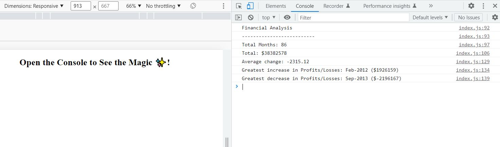

# console-finances

## Description

I made this Financial Analysis project to practice JavaScript skills, using:
- array methods, 
- loops, 
- string concatenation,
- logging the results to console, 
- using descriptive variable names,
- using comments, separating sections to make it easier to read the code and understand what it does.

## Installation

No installation needed.
## Usage

Please visit this [site](https://astarem.github.io/console-finances/) to view the project. You will be able to see the results, when you open developer tools and choose Console. All results are logged in Console:

## Room for improvement

- add HTML and CSS,
- display financial analysis results on the page by manipulating DOM.